# FireTodo

Simple Todo Application using **SwiftUI**/**Firebase**/**Redux**/**Combine**.

| Light                      | _                          | _                          | _                          |
| -------------------------- | -------------------------- | -------------------------- | -------------------------- |
| 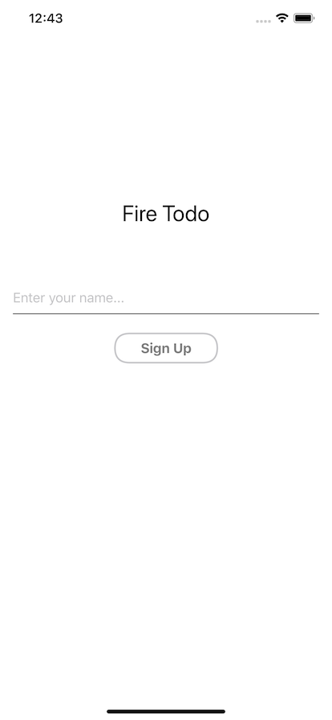  | 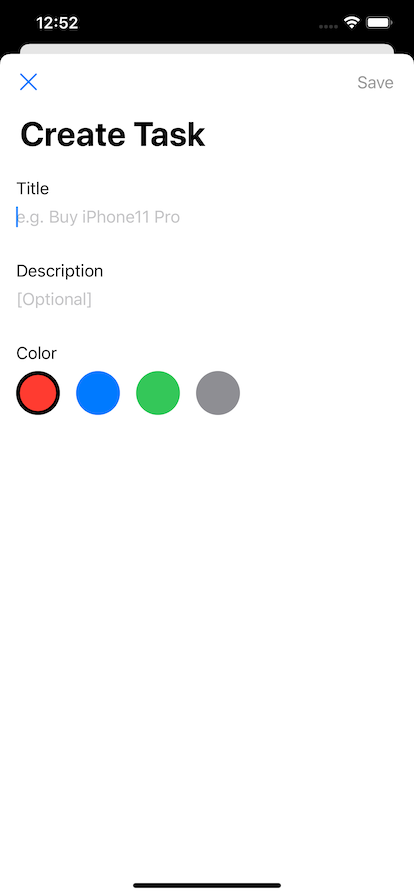  | 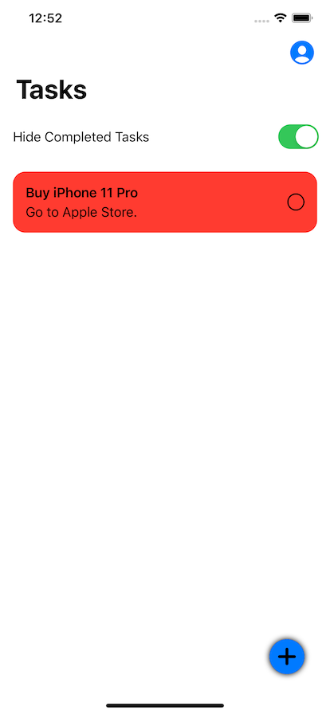  | 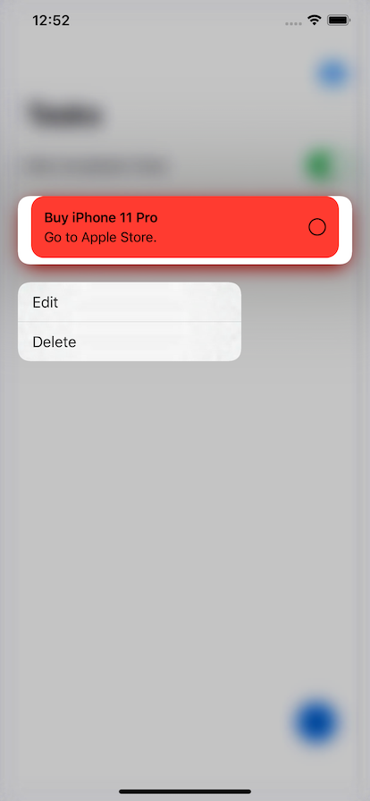  |
| 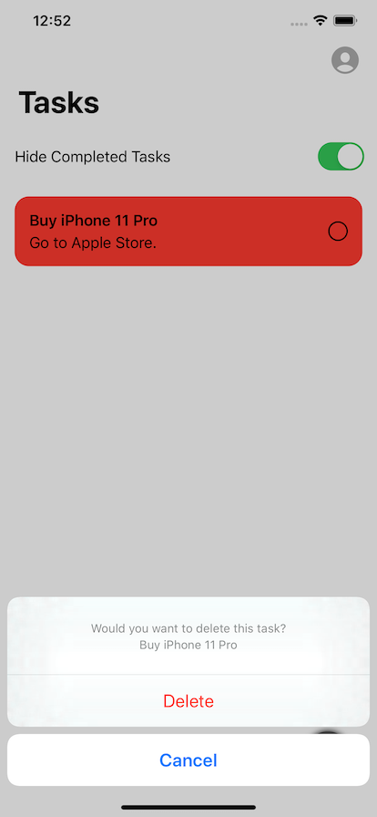  | 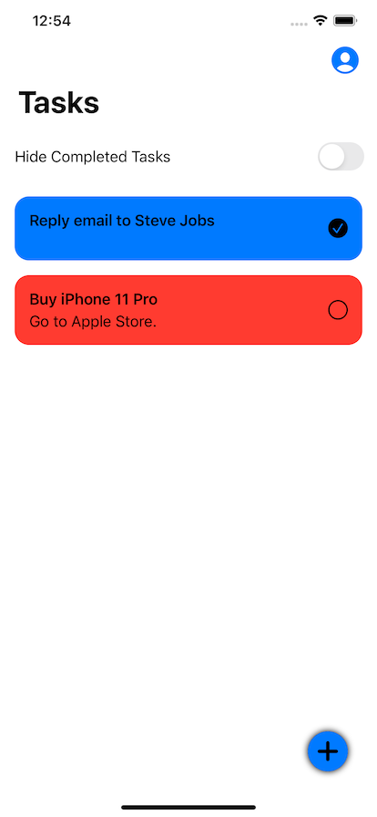  | 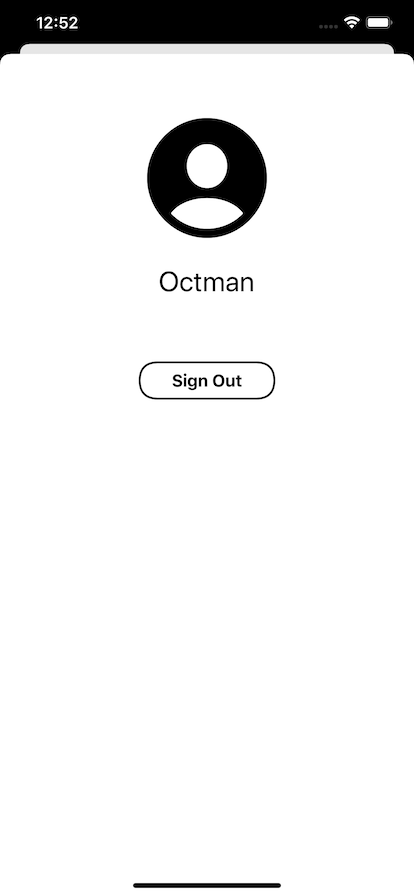  | _                          |
| Dark                       | _                          | _                          | _                          |
| 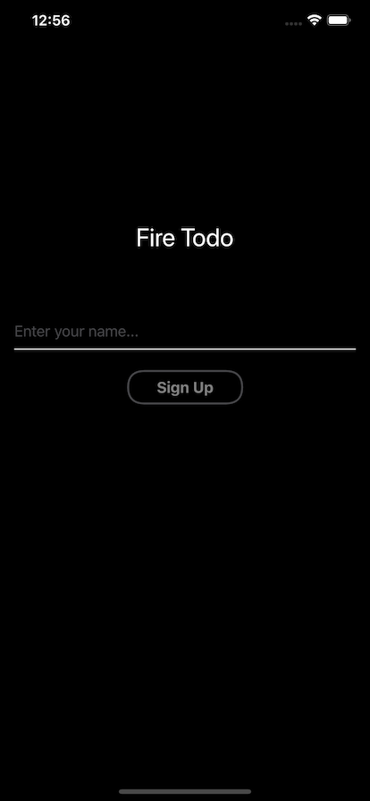  | 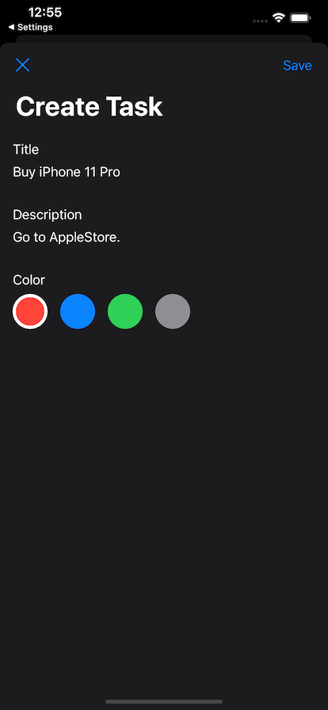  | 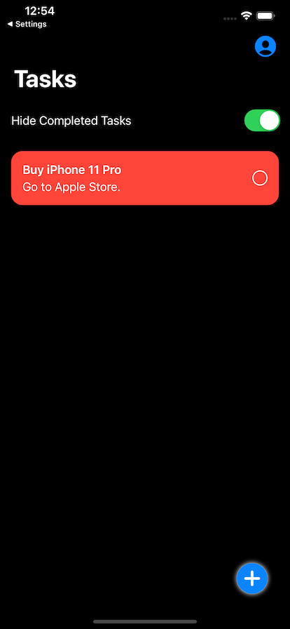 | 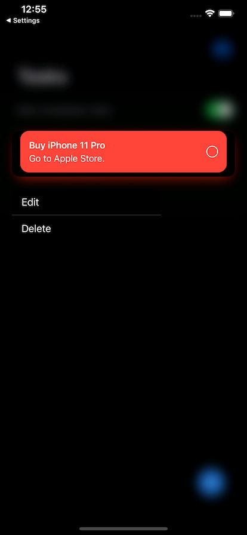 |
| 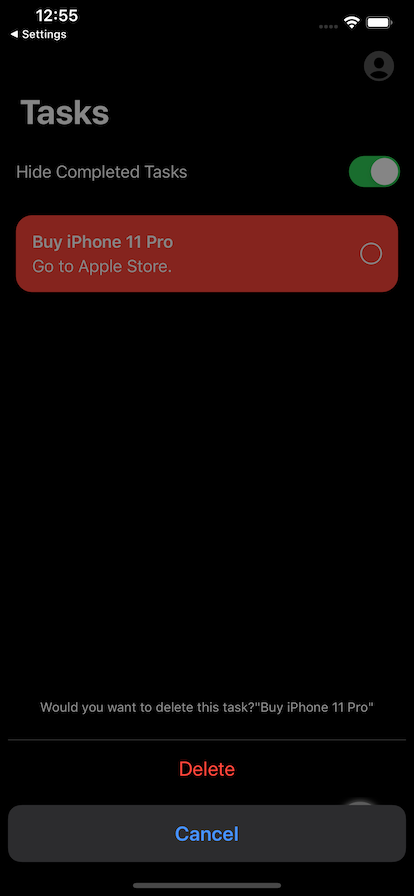 | 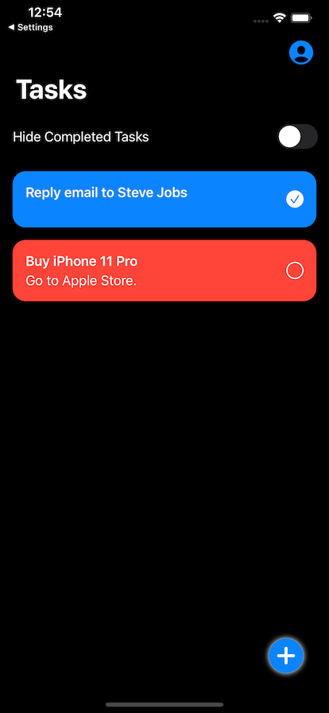 | 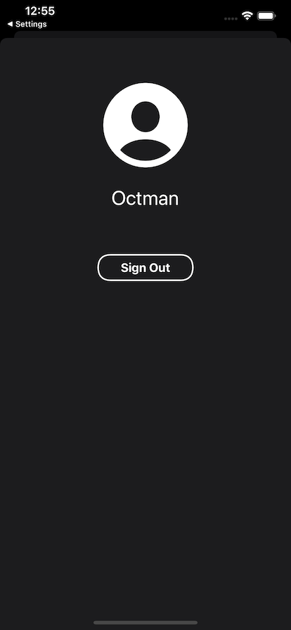 |                            |


## Feature

- Use SwiftUI fully.
- Use Firebase.
  - Authentication
  - Cloud Firestore
- Adopt Redux Architecture.
- Compatible with DarkMode.
- Adopt Context Menu for edit/delete task.

## Setup an Run

- Clone this repository.

```sh
cd path/to/FireTodo
make # run install script.
open FireTodo.xcworkspace
```

- Setup Firebase(See below.)
- After setup Firebase, you can run application!

### Firebase

- Visit [console](https://console.firebase.google.com)
- Create Project. (Project name can be anything.)
- Setup Anonymous Authentication.
- Setup Firestore using test mode.(region can be anything. In my case, I chose asia-northeast-1)
- Setup `iOS Application` and download `GoogleService-Info.plist`.
  - Bundle Identifier is same as project's Bundle Identifier.(e.g. `example.firetodo`)
- put `GoogleService-Info.plist` in `FireTodo/`

## Dependencies

- SwiftUI
- Firebase
- ReSwift(for Redux architecture)

## Todo

- [ ] Create OSS Logo
- [ ] Improve Redux flow
- [ ] Divide some views into Components.
- [ ] Edit user profile
- [ ] Use Combine Framework more.
- [ ] Put firestore.rules for improvement security.

## Communication

- If you found a bug, open an issue.
- If you have a feature request, open an issue.
- If you want to contribute, submit a pull request.:muscle:

## License

**FireTodo** is under MIT license. See the [LICENSE](LICENSE) file for more info.